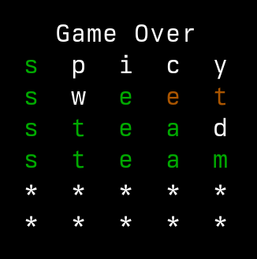

# Wordle CLI

Wordle, for the command line, written in Go.



## Install

Requires Go version 1.22 or later
```bash
go install github.com/bitmap/wordle@latest
```

Then just run `wordle` in your shell

```bash
wordle
```
